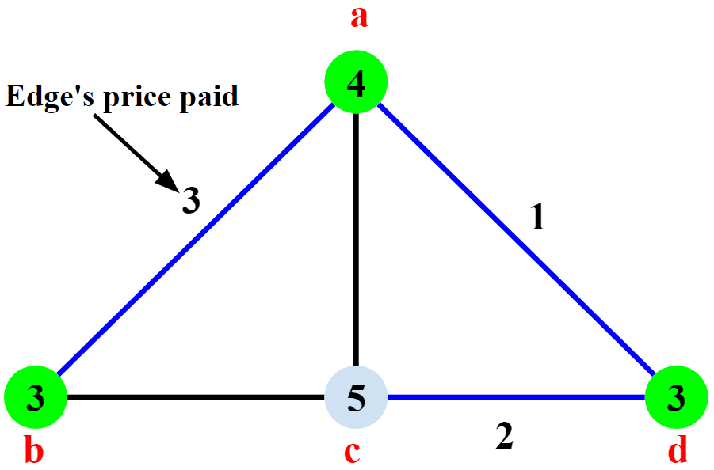

# Minimum Weighted Vertex Cover - Pricing Method (Approximation Algorithm)
Approximation Algorithm for the NP-Complete problem of finding a **vertex cover of minimum weight** in a graph with weighted vertices. Guarantees an answers at most **2 times** the optimal minimum weighted vertex cover (2-approximation algorithm, [see references for the proof](#references)).

## Problem Statement
- Given an **undirected graph** with each vertex weighted > 0
- Find a vertex cover **S ⊆ V** (where each edge has at least 1 edge in **S**)
- And the vertex cover has the **minimum total weight** (when adding weights of the selected vertices)
#### Graph1

#### Graph1 Optimal Minimum Weighted Vertex Cover

<h4>Vertex Cover = 0, 2  
Total Weight = 4+5 = 9
</h4>

#### Graph1 Algorithm's Weighted Vertex Cover (sub-optimal)

<h4>Vertex Cover = 0, 1, 2, 3  
Total Weight = 4+3+5+3 = 15
</h4>

The algorithm **does not find the optimal solution**, but the answer given is **15**, which is less than **twice the optimal value** which would be **2 * 9 = 18**  

## Algorithm Solution
The problem is **NP-Complete** but this algorithm is a polynomial-time 2-approximation algorithm  
The answer found is at most **2 times** the weight of the Optimal Minimum Weighted Vertex Cover

### Pricing Strategy (Fairness)
- Each edge ***e=(i, j)*** must pay a price Pe > 0 to the vertices **i** and **j**
- **Fairness:** an edge cannot pay more than the remaining weight of the vertex
- **Tight:** a vertex is tight when it has no remaining weight  
  

## Input Graphs
#### Graph2

#### Graph2 Optimal Minimum Weighted Vertex Cover

<h4>Vertex Cover = 0, 1, 3  
Total Weight = 2+4+2 = 8
</h4>

#### Graph2 Algorithm's Weighted Vertex Cover (sub-optimal)

<h4>Vertex Cover = 0, 1, 2, 3  
Total Weight = 2+4+9+2 = 17
</h4>

#### Graph3

#### Graph3 Optimal Minimum Weighted Vertex Cover

<h4>Vertex Cover = 0, 2, 5  
Total Weight = 2+4+9 = 15
</h4>

#### Graph3 Algorithm's Weighted Vertex Cover (sub-optimal)

<h4>Vertex Cover = 0, 1, 2, 4, 5  
Total Weight = 2+3+4+7+9 = 25
</h4>

## Usage
- Create a `new WeightedVertexCover(vertexCount)` object & pass in the **number of vertices in the graph**
- Create the graph by adding undirected edges (**only add each edge once**)  
*e.g.*  
`graph1.addEdge(0,1);`  
`graph1.addEdge(0,2);`  
*etc.*
- **The order of edges added and the names (ID's) of the vertices can result in a different vertex cover**
- Create a `int[] weights` array  
`weights[0]` is the weight of **vertex `0`**, `weights[1]` is the weight of **vertex `1`**, etc.
- Call the `printWeightedVertexCover()` method on the graph  
e.g. `graph1.printWeightedVertexCover(weights);`

## Code Notes
- `printWeightedVertexCover()` creates a copy of the `originalWeights` array called `remainingWeights` and this is the array used to see if any vertex has any remaining weight (to check if a vertex is **tight**)
- Graph is an adjacency list, an array of `LinkedList`s
- The `addEdge(int v, int w)` method is for an **undirected graph**
- `boolean visited[]` keeps track of the visited vertices in order to print the final vertex cover
- Finding the vertex cover loops over all the edges
  - Both vertices in an edge must have weight > 0
  - If an edge is chosen:
    - Both vertices are updated in the `visited[]` array
    - Then the algorithm picks the smaller remaining weight from the 2 vertices
    - And updates `remainingWeights` by subtracting `smallerWeight` from both vertices
- Printing the final vertex cover is done by looping over all vertices & printing the `true` values from `visited[]` array

## References
- [Approximation Algorithms - Kevin Wayne](https://www.cs.princeton.edu/~wayne/kleinberg-tardos/pdf/11ApproximationAlgorithms.pdf#page=25)
- [Vertex Cover Problem - GeeksForGeeks](http://www.geeksforgeeks.org/vertex-cover-problem-set-1-introduction-approximate-algorithm-2/)  
Adapted method for finding a simple, non-weighted vertex cover
