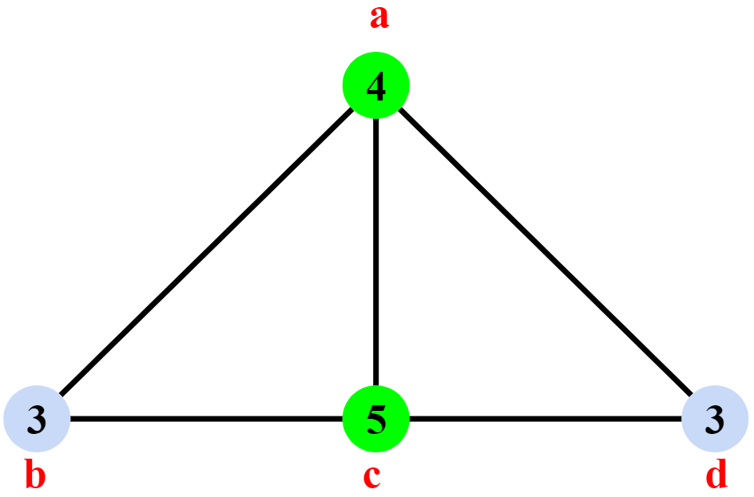
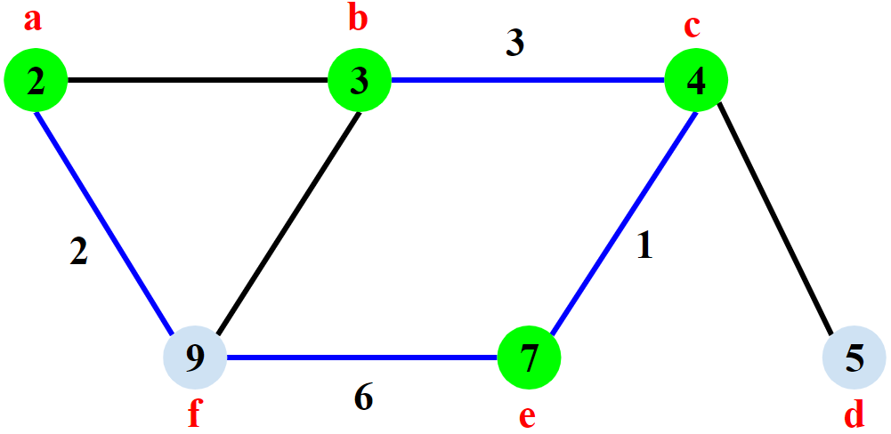
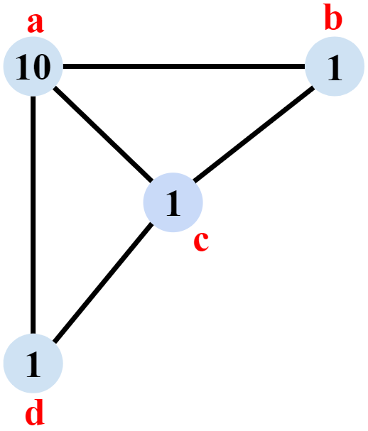

# Minimum Weighted Vertex Cover - Pricing Method (Approximation Algorithm)
Approximation Algorithm for the NP-Complete problem of finding a **vertex cover of minimum weight** in a graph with weighted vertices. Guarantees an answers at most **2 times** the optimal minimum weighted vertex cover (2-approximation algorithm, [see references for the proof](#references)).

## Problem Statement
- Given an **undirected graph** with each vertex weighted > 0
- Find a vertex cover **S ⊆ V** (where each edge has at least 1 edge in **S**)
- And the vertex cover has the **minimum total weight** (when adding weights of the selected vertices)
#### Graph1

#### Graph 1 Optimal Minimum Weighted Vertex Cover

<h4>Vertex Cover = a, c  
Total Weight = 4+5 = 9
</h4>

#### Graph 1 Algorithm's Weighted Vertex Cover (sub-optimal)

<h4>Vertex Cover = a, b, d  
Total Weight = 3+4+3 = 10
</h4>

The algorithm **does not find the optimal solution**, but the answer given is **10**, which is less than **twice the optimal value** which would be **2 * 9 = 18**  

## Algorithm Solution
The problem is **NP-Complete** but this algorithm is a polynomial-time 2-approximation algorithm.  
The answer found is at most **2 times** the weight of the **Optimal** Minimum Weighted Vertex Cover.

### Pricing Strategy (Fairness)
- Each edge ***e=(i, j)*** must pay a price Pe > 0 to the vertices **i** and **j**
- **Fairness:** an edge cannot pay more than the remaining weight of either vertex
- **Tight:** a vertex is tight when it has no remaining weight  
  

## Input Graphs
#### Graph 2

#### Graph2 Algorithm's Weighted Vertex Cover (optimal)

<h4>Vertex Cover = a, d, b  
Total Weight = 2+2+4 = 8
</h4>

#### Graph3

#### Graph3 Optimal Minimum Weighted Vertex Cover

<h4>Vertex Cover = a, c, f  
Total Weight = 2+4+9 = 15
</h4>

#### Graph3 Algorithm's Weighted Vertex Cover (sub-optimal)

<h4>Vertex Cover = a, b, c, e  
Total Weight = 2+3+4+7 = 16
</h4>

#### Graph 4

#### Graph 4 Algorithm's Weighted Vertex Cover (optimal)

<h4>Vertex Cover = d, c, b  
Total Weight = 1+1+1 = 3
</h4>

## Usage
- Create a `int[] weights` array  
`weights[0]` is the weight of **vertex `0`**, `weights[1]` is the weight of **vertex `1`**, etc.
- *(Optional)* Create `String` array for vertex names (0=a, 1=b, 2=c etc. in the example but this is arbitrary & it works as long as the underlyng graph created with integers is valid)
- Create the graph by adding undirected edges (**only add each edge once**)  
*e.g.*  
`graph1.add(new Edge(0,1, vertexNames1));;`  
`graph1.add(new Edge(0,3, vertexNames1));`  
*etc.*
- Vertex names can be left out (A names array is created automatically if none is provided using the String representation of the integer). There's an example for `graph4` which doesn't pass a names array
- **The order of edges added and the names of the vertices can result in a different vertex cover**
- Call `MinimumWeightedVertexCover.findMinimumWeightedVertexCoverApprox(graph1, weights1, vertexNames1);`

## References
- [Approximation Algorithms - Kevin Wayne](https://www.cs.princeton.edu/~wayne/kleinberg-tardos/pdf/11ApproximationAlgorithms.pdf#page=25)
- BAD [Vertex Cover Problem - GeeksForGeeks](http://www.geeksforgeeks.org/vertex-cover-problem-set-1-introduction-approximate-algorithm-2/)  
**This was a terrible mistake! This algorithm is very different from the approximation algorithm and had me confused on my initial attempt**
